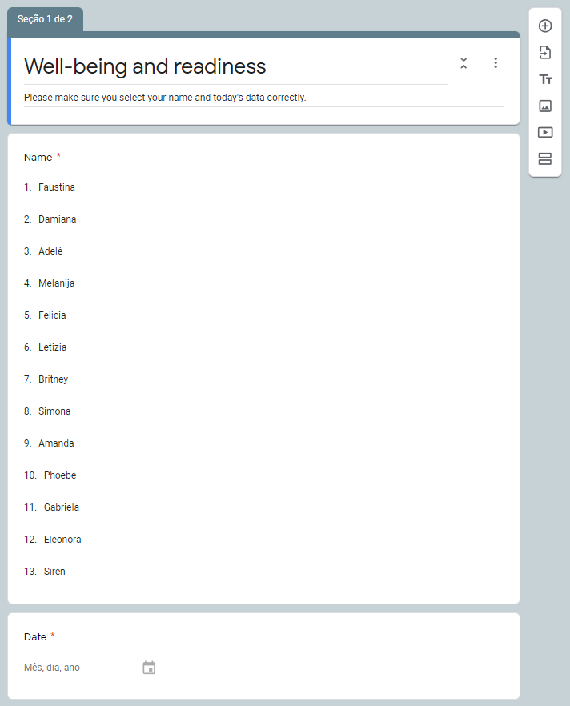
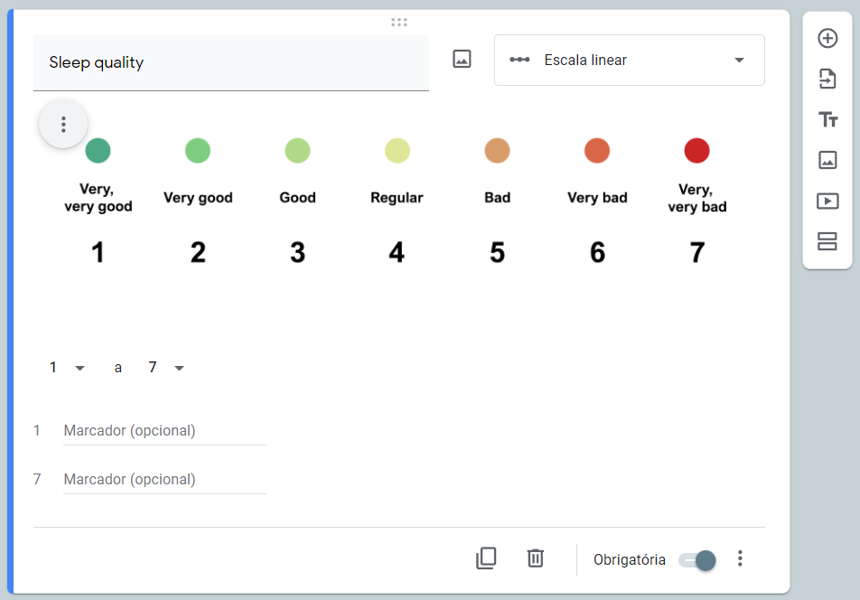
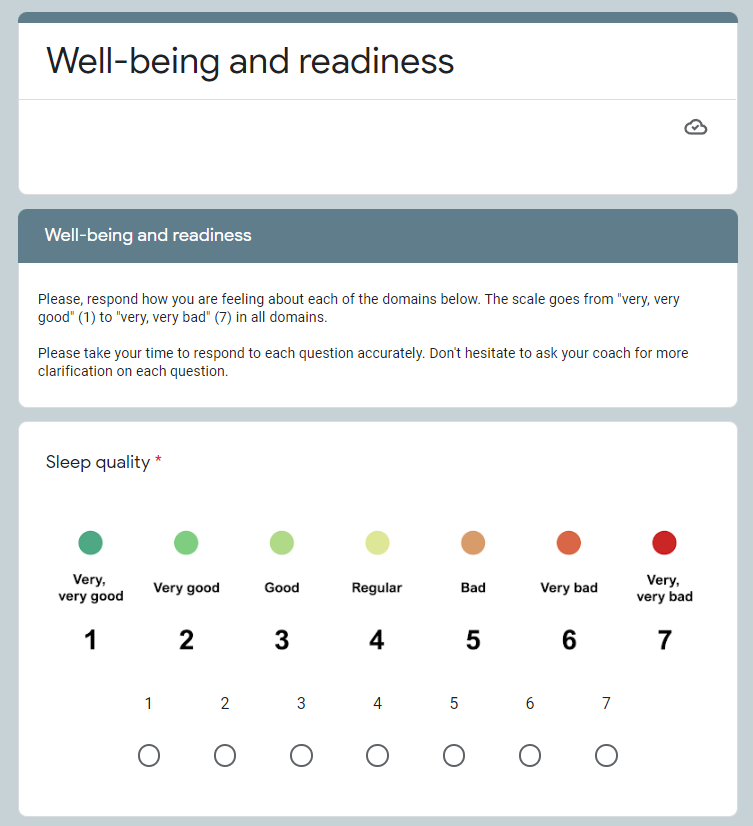
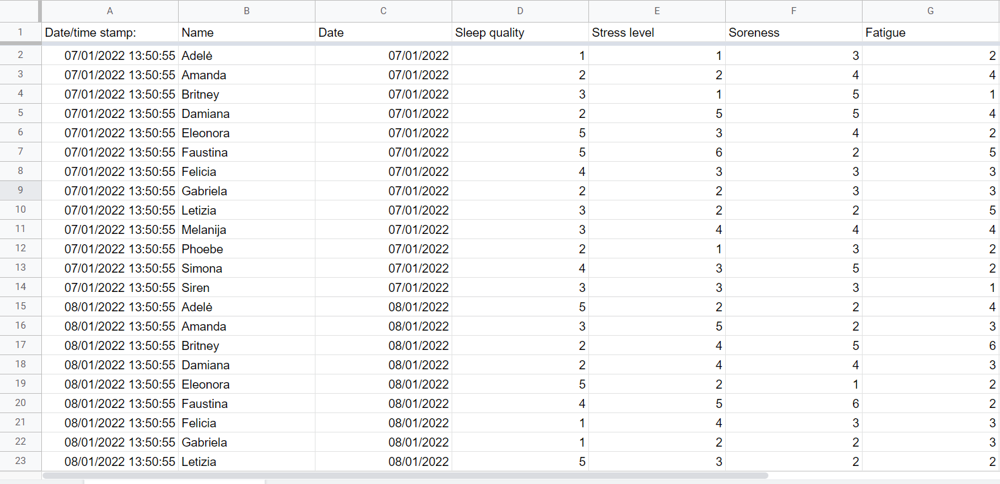

---
authors:
- admin
categories:
- Tutorial
date: "2021-01-07T00:00:00Z"
draft: false
featured: false
image:
  focal_point: ""
  placement: 1
  preview_only: true
lastmod: "2021-01-07T00:00:00Z"
projects: []
subtitle: "This tutorial will show you how to build a simple and practical monitoring tool to assess well-being and readiness score of your athletes."
summary: "This tutorial will show you how to build a simple and practical monitoring tool to assess well-being and readiness score of your athletes."
tags:
- R
- Tutorial
title: Monitoring readiness and well-being scores using Google Sheets and R Shiny
---

## Overview

Monitoring is one of the most important aspects of training. Keeping track of what is going on with our athletes (in different domains) is a the first step to manage our intervention. The simplest way to do so is by using valid questionnaires, which requires little resource. Beyond collecting data, it is important to transfer this data into information that can be easily visualized and used in a daily basis. That's what this tutorial is about.

In this tutorial, we'll cover:

1.  How to build a well-being and readiness questionnaire using Google Forms
2.  How to build a simple Shiny app that will automatically read the responses from your Google Sheets and resume into useful information.

 

## First things first

-   👉 If you are unfamiliar, you need to download and install [**R**](https://cran.r-project.org/) and [**RStudio**](https://www.rstudio.com/products/rstudio/download/). R is the programming language and RStudio the IDE where we will set things up.

 

## Creating the questionnaire using Google Forms

We need to start creating our questionnaire using the [**Google Forms tool**](https://docs.google.com/forms/). This tool is pretty straight-forward and you can customize your questionnaire in many ways.

I will create a questionnaire including five domains of well-being and readiness, named: sleep quality, stress, soreness, fatigue and mood. The scores of each domain will be assessed using a seven-point Likert scale (from 1 to 7).

Keep in mind that you can change these domains and the score scale to fit your purposes and references.

In the first section of my questionnaire, I have included only two questions:

1.  **Name** (so athletes can identify themselves when answering)
2.  **Date** (to inform the date corresponding to that response)

These two questions are marked as mandatory so the athlete can advance to next section of the questionnaire.





In the next section, I've added the questions of each domain using the "linear scale" option, with scores ranging from 1 to 7.





You can notice that I've added an image to describe each score associated with a number. I've even added some colors to it. This may be particularly interesting when putting young athletes in contact with questionnaires like this for the first time. I wouldn't recommend this with older/experienced athletes.





### Looking at the data

Once our questionnaire have some responses, we can look at them linking our questionnaire to a Google Sheet. This can be done clicking in the Google Sheets icon in the answers tab in the settings. We are pulling our data from this Google Sheet in next steps.





### Building our Shiny app

Now that we have a sound questionnaire and plenty of responses to analyze, it is time to bring our problem to R.
